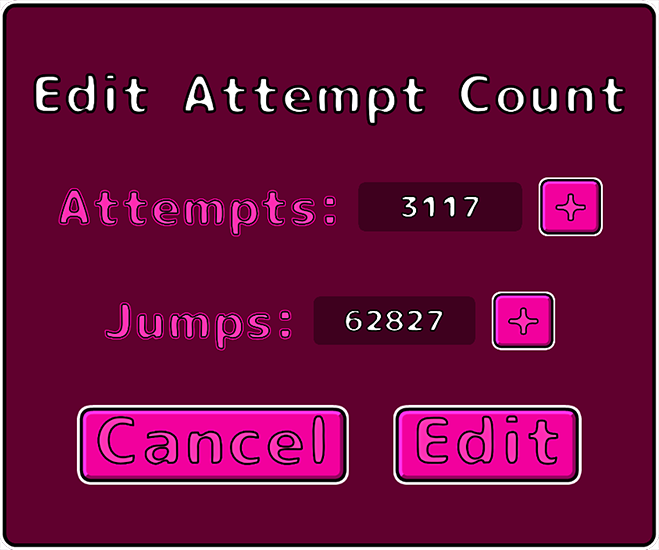

# Attempt Count

Edit current or total level attempt counts in the game geometry dash. You can also edit the jumps and time.

There is no undo button! I'm not responsible for losing attempts.

### Installation

1. Install [Geode](https://geode-sdk.org/).
2. Place the `.geode` file from releases in the geode/mods folder located where you installed Geometry Dash.

### Compiling

1. Install [Geode CLI](https://docs.geode-sdk.org/getting-started/geode-cli) and then the sdk.
2. Run `geode build`. It is automatically installed to Geometry Dash if set up correctly.